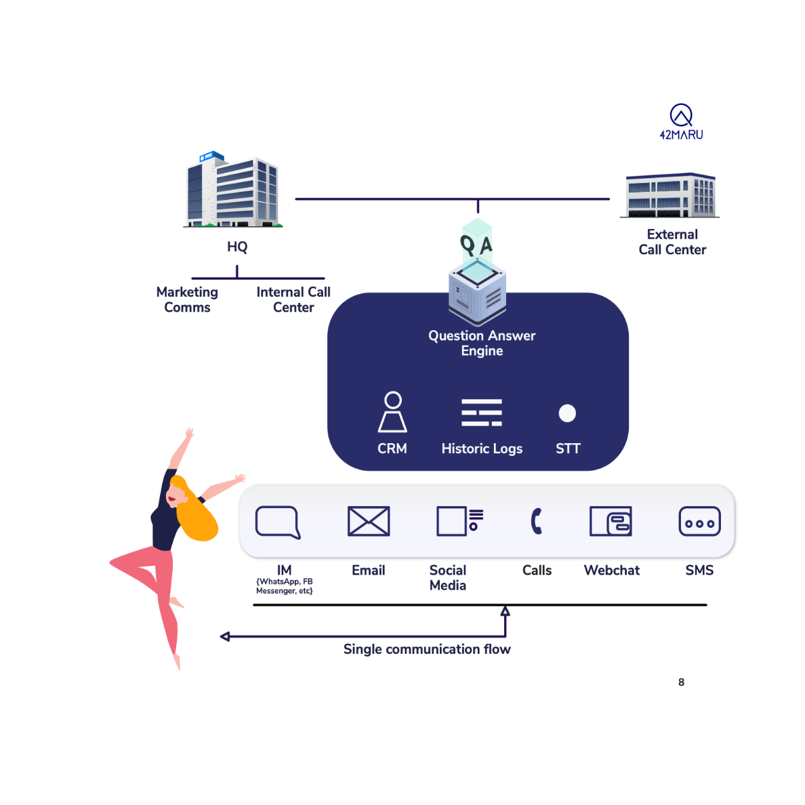
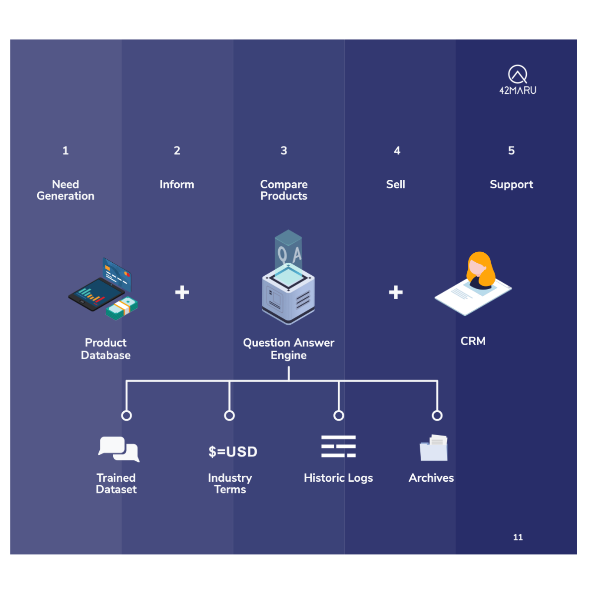
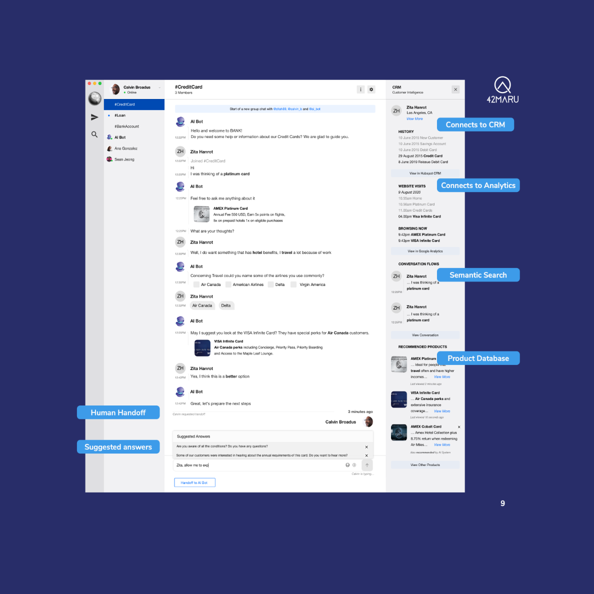
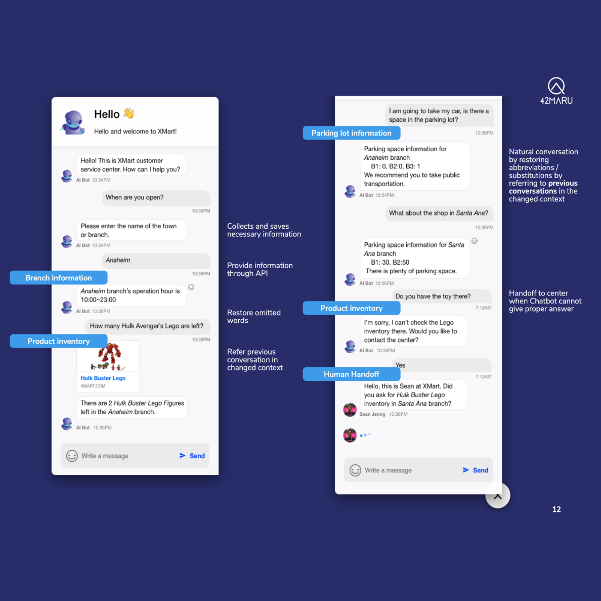
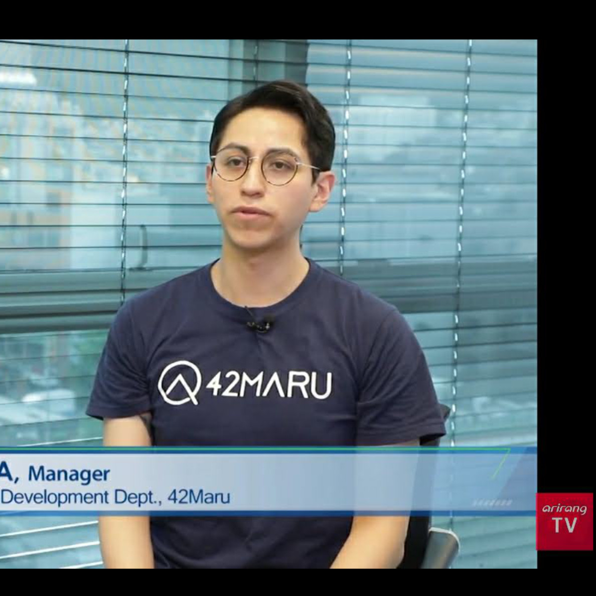

## Summary

Esteban was the business specialist for a product concept that unified the diverse technology {chat, NLU, search, big data} being built by the company.   

## 0. Prior

The OBD (Overseas Business Development) team was tasked with demand generation for the NLU search engine that the company was developing. 

As a newly created team, documentation, processes and material was not available. 

#### Branding

Esteban co-created marketing material for the team based on the extensive and complex technical ad-hoc specifications sold to local Chaebol companies. 

To simplify the offering, all projects were categorized under three core families: *enterprise*, *chatbot* and *smart devices*. With these all Korean content was translated to English and simplified as downloadable use cases. 

#### Website

To house all the new content and reduce the introductory PPT, a new website was created. Aligning with the core tech of the company Python was used. The stack included Django and Wagtail CMS implemented over two months. The custom set up was flexible and easy to manage by non tech members.  

The changes also improved SEO results with better content, keywords and metrics, doubling daily visits to website within 3 months, multiplied by 10x web presence and, created a tiered funnel using Hubspot.

## 01. Research

An experienced R&D expert (ex-Samsung and ex-Akamai) led the technological side and Esteban the busines side analysing various industries and the technology available overseas. 

## 02. Product Design

 Over a couple of months a various product concepts were created. The one with most potential was an assistant could be applied to companies with large customer bases. To serve as single source of truth via AI chatbots for support staff to offer personalized services. 

The product concept included: Market opportunities, competitors, development roadmap, screen designs and database structure.

## Representative

As a member of the OBD team, Esteban participated in online and physical events, including an appearance in Arirang TV. 

