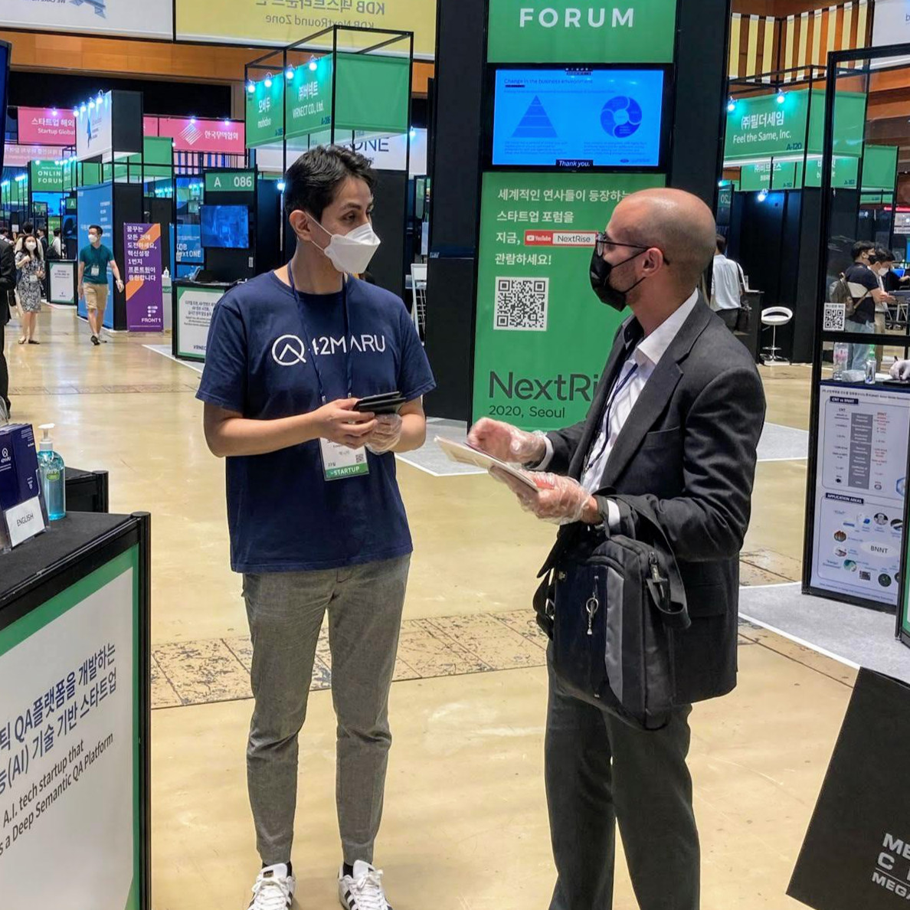

## Business Development

The OBD (Overseas Business Development) team was tasked with creating pathways for the search technology of the company to be applied in international projects.

The core limitation noticed was that on the difference that Korean chaebols work compared to international companies of similar caliber. Most local projects were sold based on connections and ad-hoc specifications. 

Marketing material was mostly +70 page PPTs that were higly technical and difficult to understand. 

## Branding

In order to simplify the offering, all projects were categorized under three core families: *enterprise*, *chatbot* and *smart devices*. With these all Korean content was translated to English and simplified as downloadable use cases. 

### Website

To house all the new content and reduce the introductory PPT, a new website was created. Since the company core tech is written in Python, the technology used was also Python: Django + a personalized Wagtail CMS were implemented over two months. This custom set up allowed flexibility creating content by using bootstrap elements and was easy to navigate by non tech members.  

The changes also improved SEO results with better content, keywords and metrics. 

## Product

 

After analysing various industries and the technology available an experienced R&D expert and I developed over a couple of months a product concept that could be applied to Call Centers and would position the company at an advantageous position to export.

The product specifications included: Market opportunities, competitors, roadmap and database structure.

