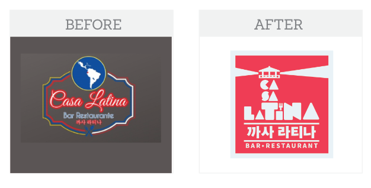
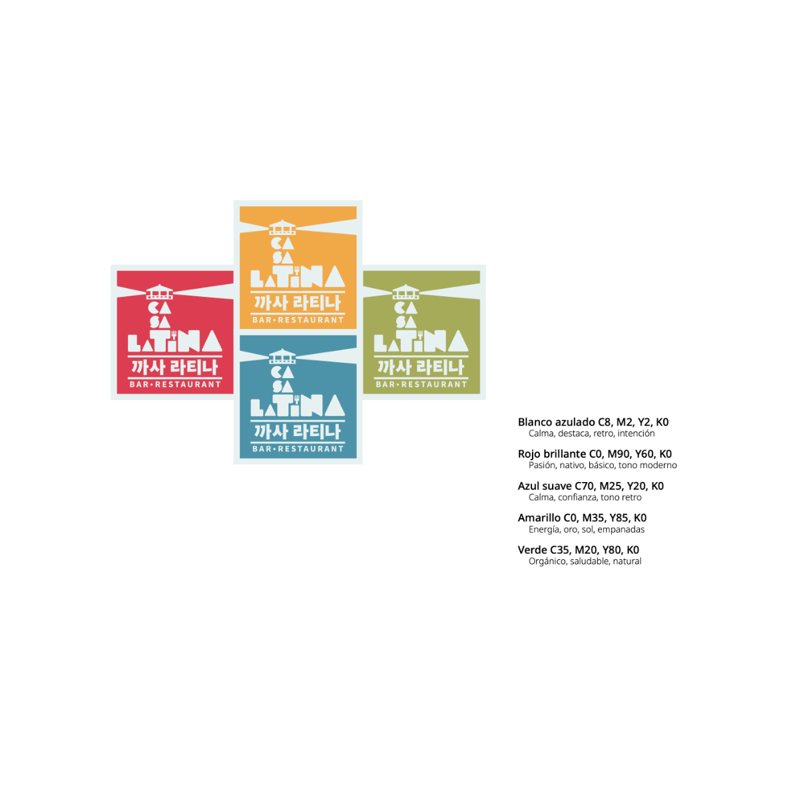
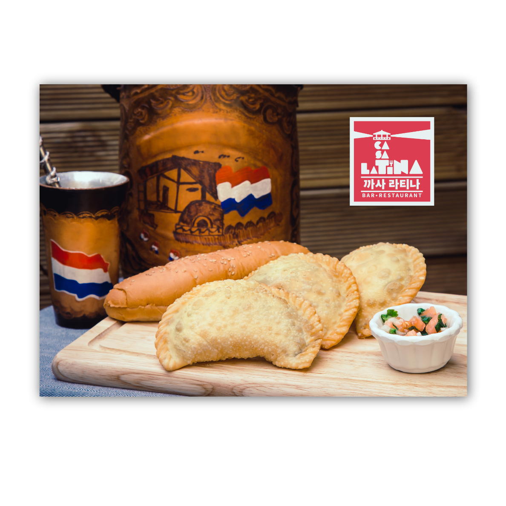
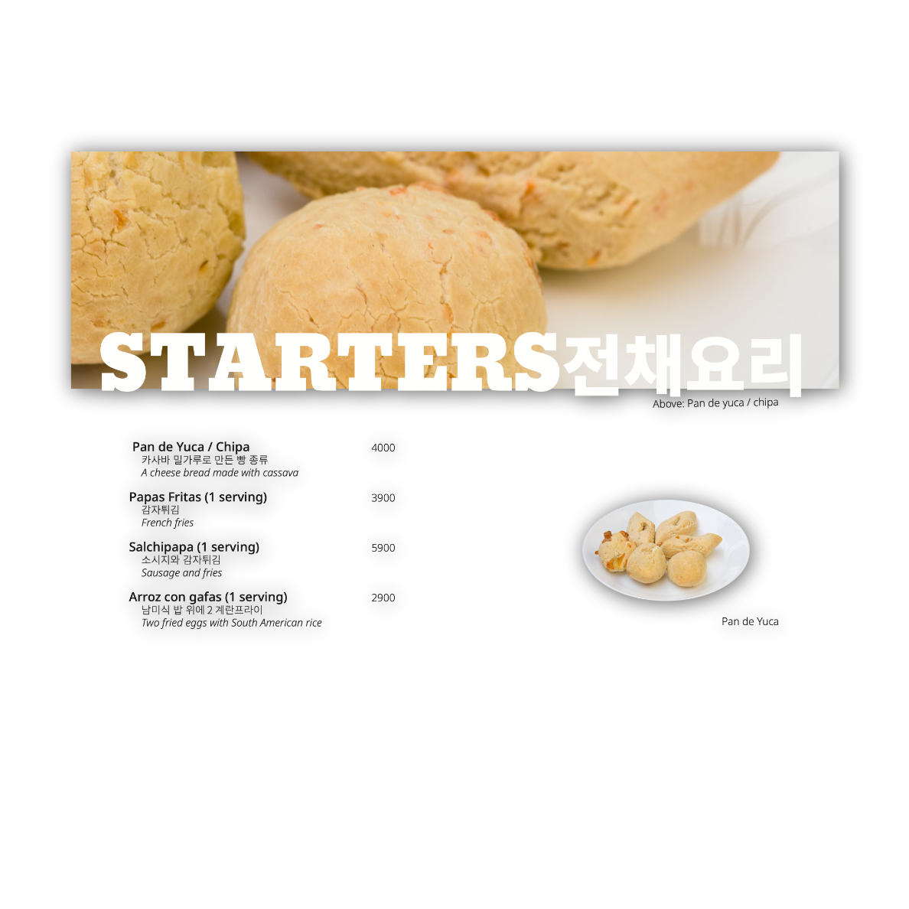
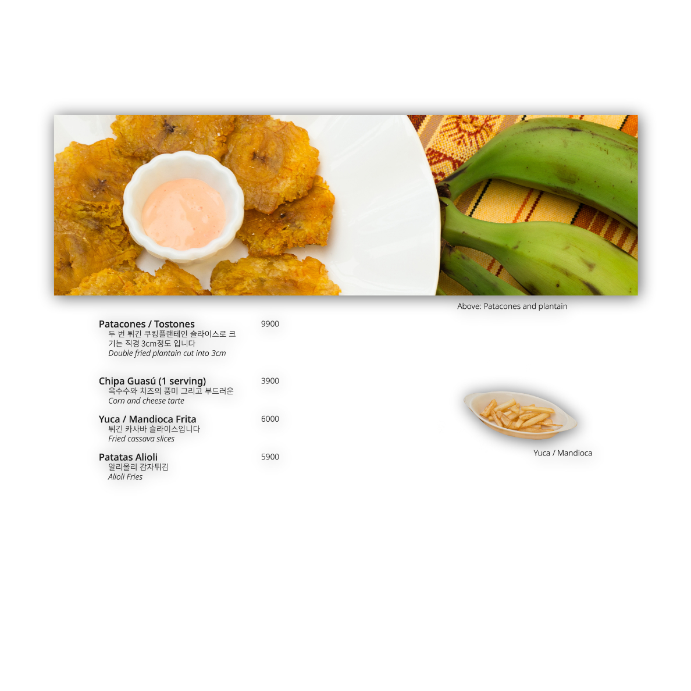
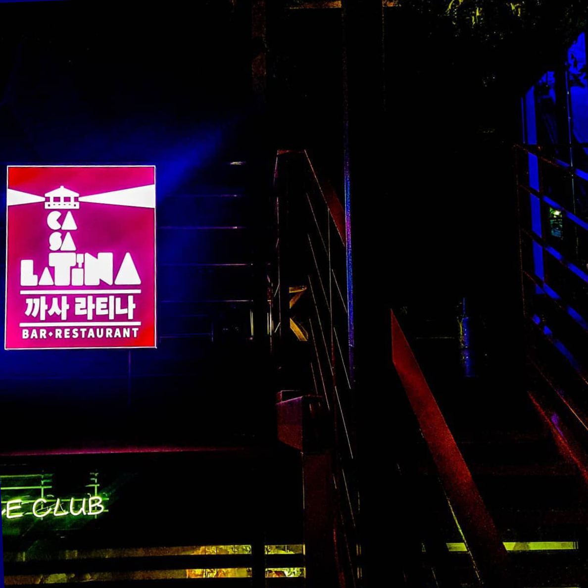

import { Row, Col } from "react-bootstrap"

## The *lighthouse* concept 
The restaurant sits atop a building on a hill that overlooks the Hapjeong area of Seoul. 

Owned by a couple that has lived for over 12 years in Korea and are well known and loved by all the community.

### Request
The original design lacked personality. 
I wanted to emphasize the importance of their place as a beacon that connects people. 

The location of the restaurant as a penthouse gave me the perfect idea to work with: a lighthouse. 

### Delivered

The new style was retro with references to a stamp. A new menu offering was also photographed and launched along the brand. 

