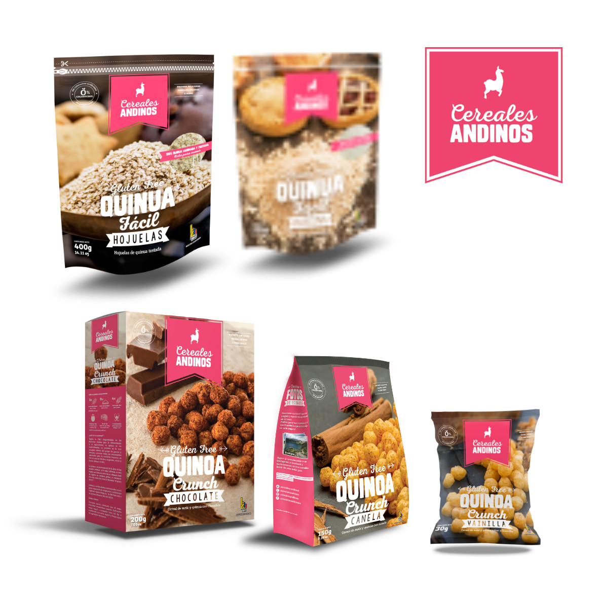
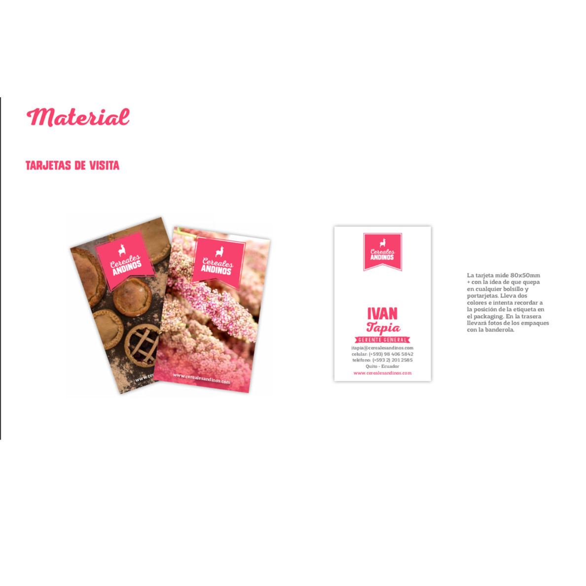
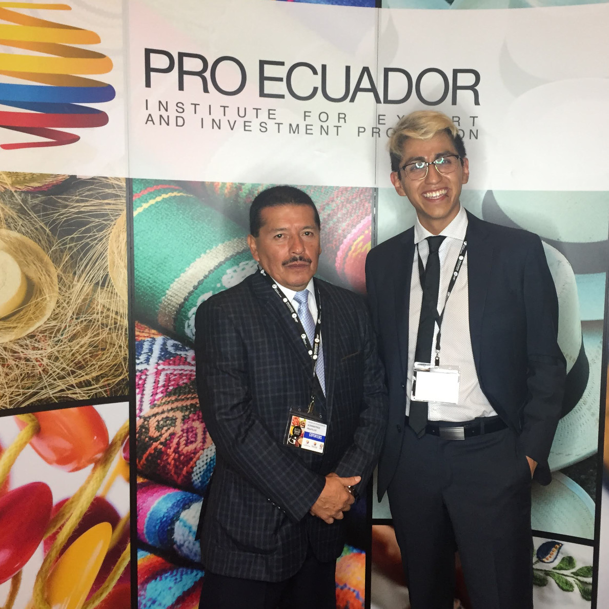

## Product

After researching the food industry, I matched the ingredients, production process and industry trends to create a product concept based on a healthier diet: Quinoa Crunch.

The focus on *special dietary needs* required improvements in all production processes. Working along with a Production Manager and Quality Manager we prepared a plan that would lead to iterating updates on products as well as implementing HACCP, NonGMO and Gluten Free certifications.

The v2 solved all the shortcomings of the original product, increasing its shelf life to 1 year (a soft requirement for exports), improving its quality, taste and nutrional tables. 

The v3 was prepared to move towards organic ingredients and a higher nutrional value. 

All product iterations were tested locally and some prototypes taken to international fairs for validation from business partners.

## Branding 

The new product line and strategic concept led to a new brand image that engulfed the company. The brand was initially designed as *Celifood* but renamed locally as *Cereales Andinos*.  

The brand concept was: transparency, with a photoshoot style that showed the ingredients, clear direct style of communication and packaging that stood out in the shelves. 

The innovation focus I implemented in the company also meant that anything that was needed could be designed: from promotional materials to sale sheets and product specs were all prepared and improved after key meetings and events. 

## Business development

The change in packaging and style caught the attention of the retailers and target audience allowing the product to grow rapidly in shelf space. 

Top of mind was created through sponsoring sporting events, participating in the startup scene and through key placements we positioned the product as the healthier alternative for breakfast. 
The product quickly gained followers in the healthy living and gluten free communities growing in all social media and leading to radio and television interviews. 

To promote the product we attended international fairs and eventually we exported to Chile, USA, South Africa, Lebanon, and Panama. 

