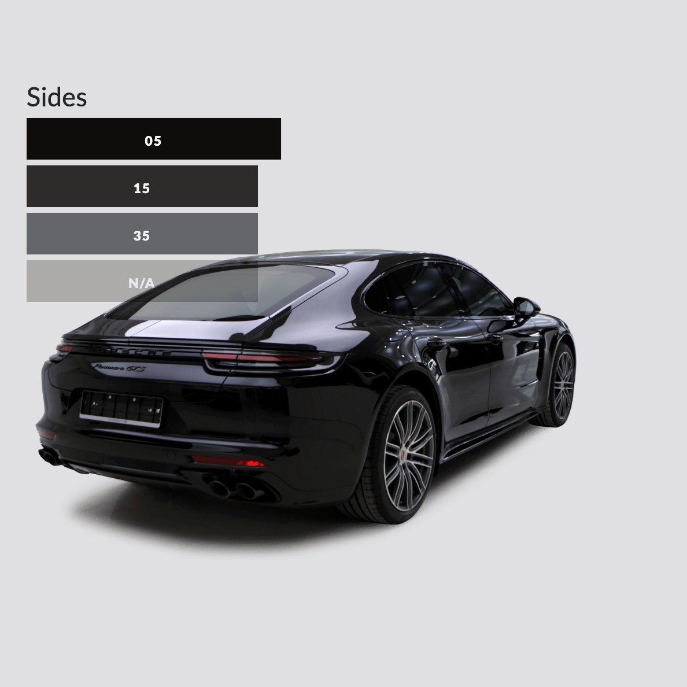

## Business development

I helped this Korean window tinting franchise to prepare their plans to internationalize from scratch. Starting with researching possible target markets, preparing the necessary documentation and then being the liason for all foreign customers. 

Although their brand is locally strong, all digital content was highly focused in Naver (Korea's main search engine) and lacking presence outside of Korea.  

With the help of the graphic designer we prepared all marketing and promotional material, redesigned the foreign website to explain the different product families, and I copy wrote all their content to help it position better in Google.

The result was seen over a few months: business opportunities grew and led to the openings of shops in Colombia and Saudi Arabia. 

