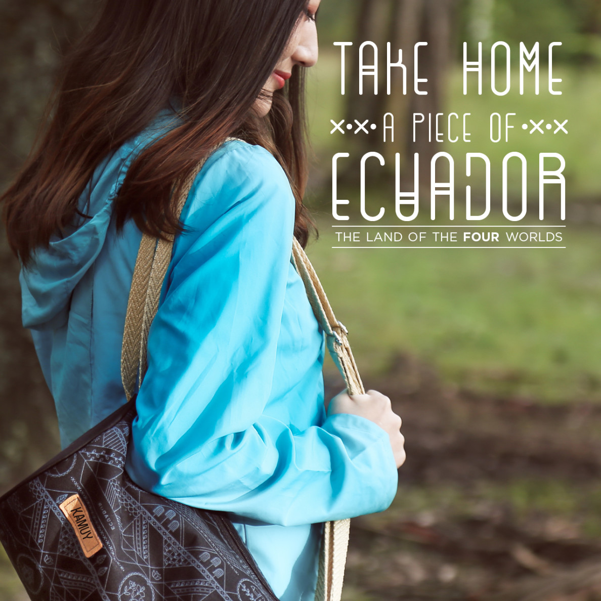
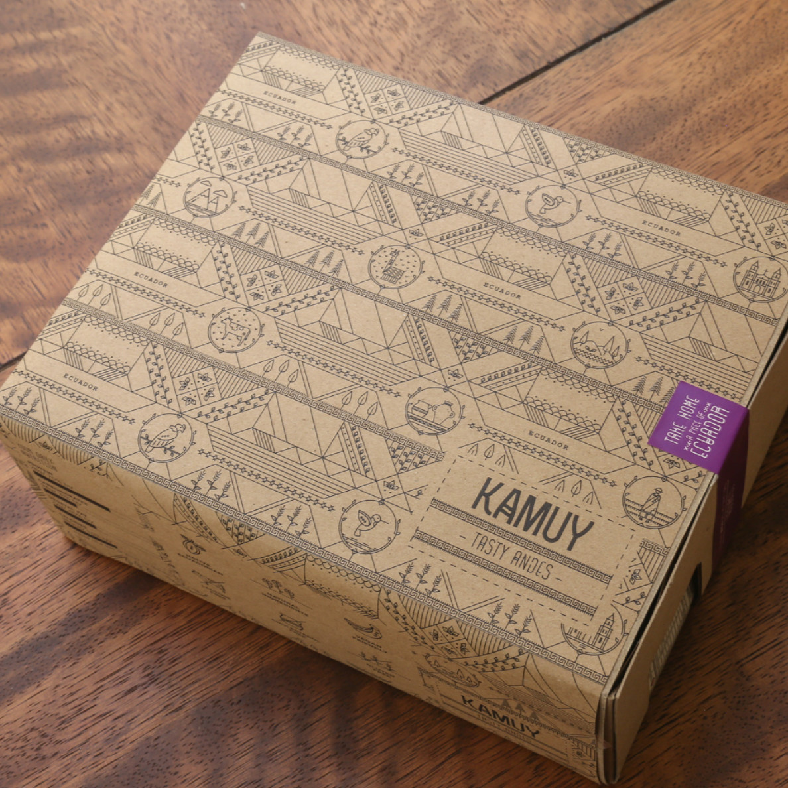

## Consulting
I led a group of food startups organized in Quito's Chamber of Commerce to develop a product line for the tourism industry. We market researched, worked with a graphic design team and prepared various product concepts for market testing and launch. It allowed all the companies to learn more about the tourism industry and also prepare specific offerings for each. 

