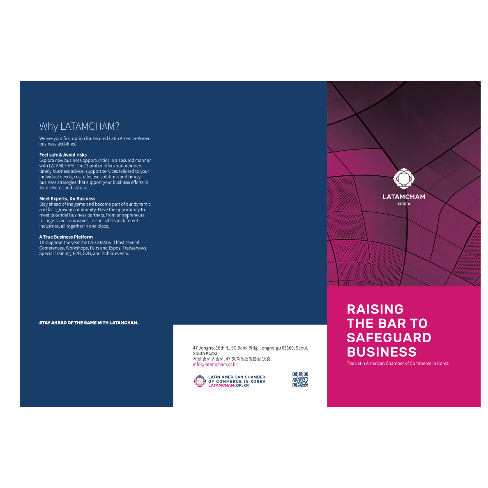
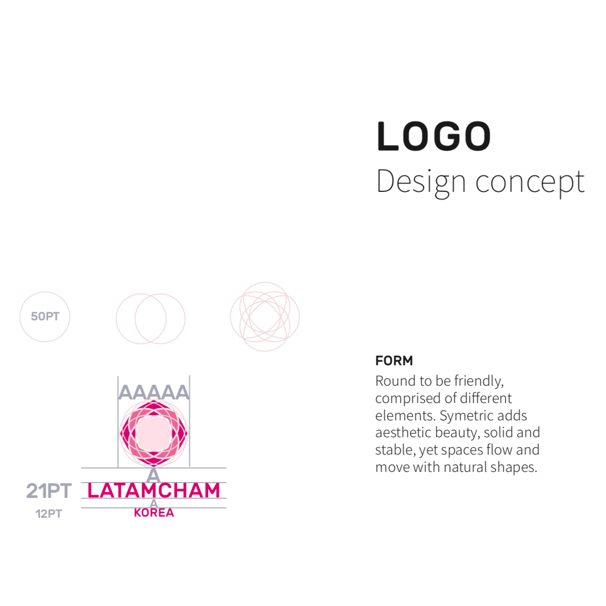

## A unified Chamber of Commerce 
Korea is a powerhouse in trade with limited natural resources. An interesting market for the resource rich bloc of Latin America. 

The Latin American Chamber of Commerce grouped together to support enterprises entering Korea, a country where trust from verified contacts is key to business.

### A change of style

The Latamcham had to represent various countries with very diverse history and style yet maintain references to the local market. To achieve this the rose, one of Colombia's and Ecuador's biggest exports was chosen as the core isotype. The colors needed to reference the *Taegukgi*, Korea's flag, and their national interpretation of the YingYang. 

