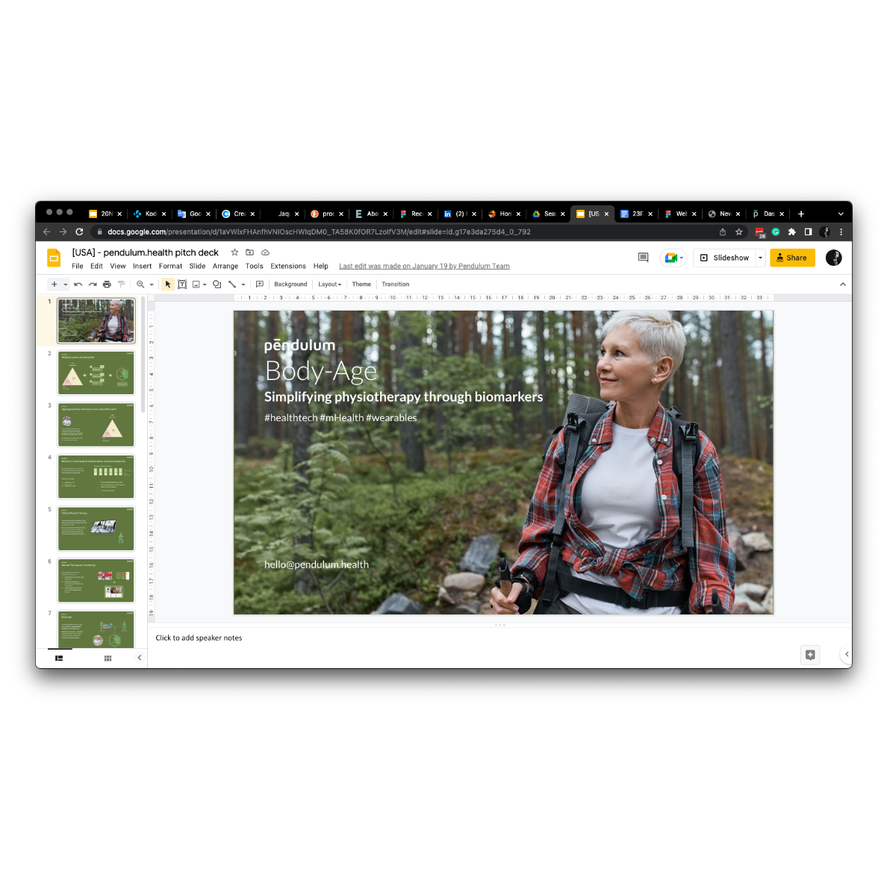
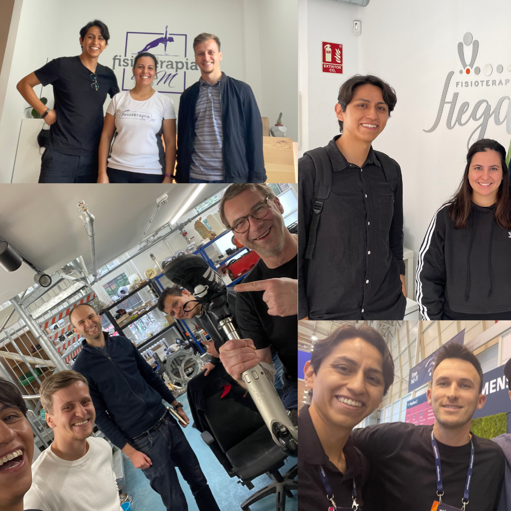

## Summary 
Esteban was in charge of product concept, product management and product launch.

## 1. Research and Strategy

Analyzing the market conditions of Germany and the trends within European investment showed movement within digital healthcare. In this space, there's three types of startups: those that heal (outcome focused), those that support therapists (medically focused), those that change processes (technological focus).

A large underserved market was found amid physiotherapy professionals. Whose work is highly stressful and increasing documentation demands interrupt their day to day.  

An opportunity to create a solution that simplifies this process via wearables and software integration was conceived.  To develop the solution we spoke with therapists in different cities of Germany, Spain and India. 

### 2. Product Design

Along with a team comprised of post-doc in Computer Science and a Biomedical Engineer we developed various products building parts of a larger solution. 

Esteban held ongoing user interviews, designed product concepts and prepared startup approaches for 4 different potential products. 

### 3. Launch 

* A concept demo was prepared for Startup Nights event in Berlin 
* A pilot project testing walking symmetry was prepared for Horus Prosthetics
* A POGs demo was prepared for prosthetic therapists in Ukraine
* Various demos were shown to physiotherapy and Parkinson therapists in Spain

Esteban participated in networking events, prepared presentations, designed the *brand*, other communications (website and blog), videos, and promotion through online and offline events. 

