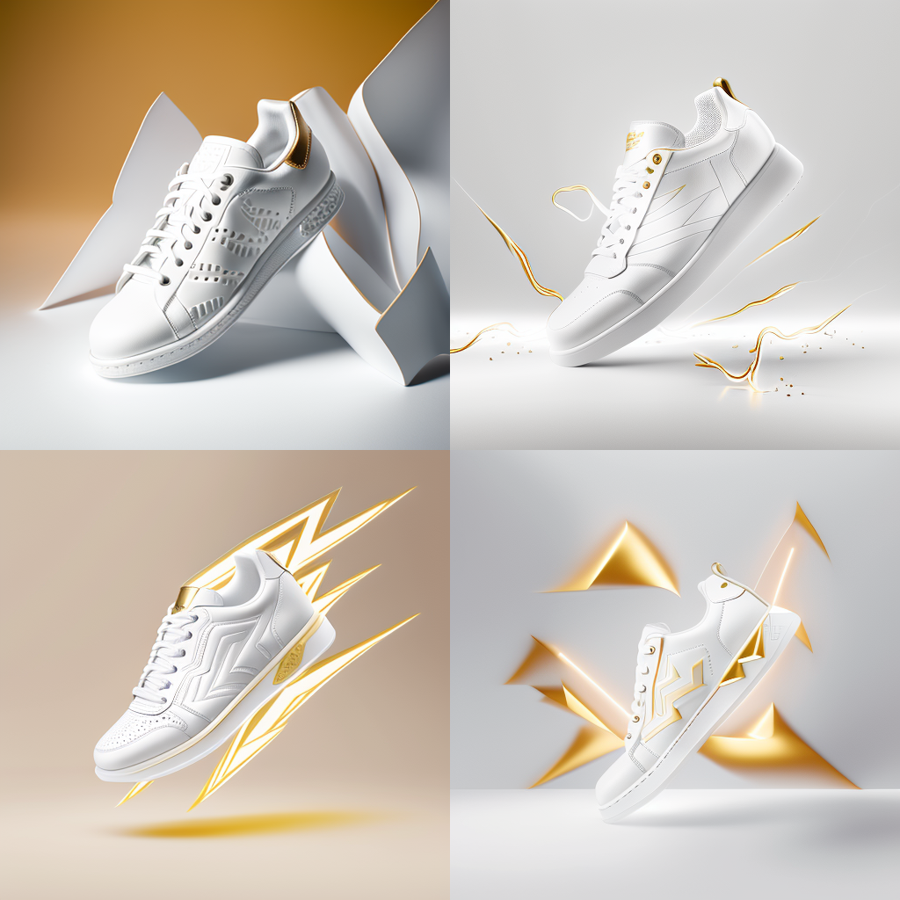
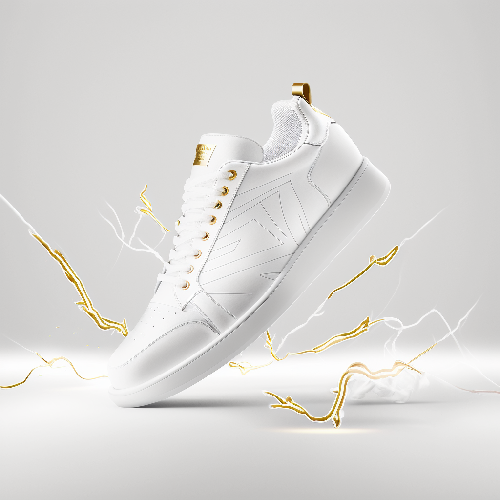

## What is product strategy?

By analyzing a market need we can develop products that are directly positioned for audiences. It reduces effort because user requests are answered through the product conception instead of later through positioning strategies. 

---- 

*e.g. Let's develop a pair of white sneakers as a luxurious item targeted at a younger audience that is trying to scale socially in South Korea.*

--- 

In order to prepare the project it is necessary to know our current status first.

## 01. Research 

In order to prepare the best strategy we must understand the three C's in marketing.

* Customer Report: A deep analysis of the current market status, including PESTEL, customer needs, objectives, communication style, aspirations, etc. 
* Competitors Report: A wide horizontal view of all providers that offer a service that can quench the need of customers. It could be direct or indirect competition. Important to also look into government backed projects and startups.
* Company Report: How is our company and products perceived now? 

### Customer Report 

It's done to understand how an audience behaves now and where it will have needs later. We must understand the economy and zeitgeist. 

#### PESTEL
Political, Economic, Social, Technological, Environmental, Legal.

By analysing the status of a country we can learn a lot about how people think and what their core needs are. 

*e.g. South Korea has a strong democracy, is a developing economy with a strong social contract and high technology, improving their environmental status and with a highly detailed civil law format.*

#### Exports
By analyzing the main components of GDP we can understand where to find the key gatherers of wealth.

*e.g. South Korea's exports compose ~70% of GDP. Their main industries are machinery {Doosan}, Semiconductors {SK Hynix}, Vehicles {Hyundai, Kia}, Ships {DSME. Hyundai Robotics}, Electronics {Samsung, LG}, Chemicals {Lotte}, Culture {CJ, Naver}*

#### Social structure
We need to see how society is structured, what are the key influences, aspirations. 

*e.g. Although half the country has no specified religion, the other hald have are adept Christians, Protestants, and Buddhists. However society is highly organized by Confucianism. Which aligns with a  social contract that has higher power than the government. Civials police each other so less force is needed from the police*

#### Influences, aspirations and fears
By detecting who society admires, we can understand the objectives that people set themselves, as well as the ingrained fears obtained from their ancestry. 

*e.g. South Korea has been following the path of Japan and admires the US. Families encourage the young to study in American Universities, companies look for inspiration in Silicon Valley and people consume American Culture. Their objectives are to become a highly developed Westernized nation, but their fears are losing their own values, so a lot of localization happens to products and services*

#### Actual needs
Necessities are considered based on the context of the user. Commodities such as shoes are attributed a secondary characteristic that helps to demonstrate personality traits (stylish, knowleadgeable), professionalism (dedicated shoes for a specific sport), and social status (luxury). 

#### Customer Summary
1. People are attempting to socially climb, they see US education and working in a large Corporate (Chaebols) as the best paths. 
2. Because the peninsula is highly isolated, society has a strong control, and content is localized there's a highly modified perception of Outside (외국) and localization is important.    
3. Since they are highly influenced by western society, their idea of luxury and success are American or European. We can see European cars, and brands and pastimes such as Golf, Art and Music.   

### Competitor Report 
It's done to explain how each need is served by different means. It's recommended to look from a horizontal (user) standpoint and from a vertical (industry) standpoint.

#### Direct competitors 

We document potential competitors based on offering the same core service, regarding the parent company we gather as much information as possible about their mission, strategy, funding, finances, annual reports, news, employee information, internal structure, etc. 

Regarding the products, those that are focused directly on the audience we are targeting. We can use segmentation criteria, messaging type, etc.  

*e.g. luxury sneakers range from limited version Nike's, passing by guest designers like Ye x Adidas, all the way up to Haute Couture from design houses* 

#### Indirect competitors 

In case our product or our competitors aren't used, what other options are there? In some cases the alternative is to do nothing. 

*e.g. In this case non luxury but unique sneakers are one of the options or other luxury footwear*

### Company Report 

We need to take a look at our current offering and benchmark with competitors thinking about user needs. In the case of most products, reviews are good starting point. 

We gauge our differentiation, team, strategy, style, etc. using a SWOT matrix to detect where more effort needs to be put.  

Our company should be able to provide services that are equal or superior if we choose a value competitor strategy. Otherwise, we can compete in price. 

----

## 02. Product Design

#### Conclusions from reports 

1. This audience has disposable income and the need to social signal in ways that match their concept of wealth. This audience is more polished than the nouveau rich, so using direct messages would feel tacky, we need to pick a more elegant approach.  
2. A strong social need to participate in the aspiration of society could lead to trends that create exponential growth.
3. Messaging through admiration for lifestyle from overseas with a localized flavor makes products more palatable. Important to have representation of localized overt success. Playing into social situations relevant for Korea.
4. For example: Social media posts of a Korean celebrity enjoying a tour in the Louvre while wearing our sneakers. 

#### Product ideas

We make potential products that answers the P's in marketing using information about the target users.

*e.g. we are going to develop a sneaker that is more on the elegant side, not pompous and can be used with business casual clothes* 

* Product: White Sneaker inspired by golf or tennis shoes
* Placement: Self branded shop in Cheongdam district, online sales from own store, department stores. 
* Promotion: IG influencers, product placement in K-Drama 
* Price: Slightly above Adidas or Nike special edition, but below designer brands
* People: 30 year olds that want to feel trendy 

#### Potential products

*Images generated via midjourney AI*

---

## 03. Launch

Once the product and all the material has been prepared, we can focus on promotion and positioning of the product. 

Positioning is how an audience perceives a company, product or person. 
By orchestrating different actions we can lead an audience to place a product in a specific mental place / status. 

*e.g. our shoe is associated with being elegant and a luxurious lifestyle, so it should be found in places where luxury is celebrated, sold in department stores, and worn by chic executives during cocktails in a country club*  

It's key to match what users imagine with the information and media provided to lead to a *cycle of truth*. 

Once the product is perceived as aspirational, all others who are trying to socially climb subscribe to it. User base multiplies exponentially. 

----

In essence those are the core steps to launch a product succesfully. Of course, being aware of market conditions, seasonality, zeitgeist and culture is key. 

I'll be happy to answer questions you may have, feel free to [contact Esteban](/contact)