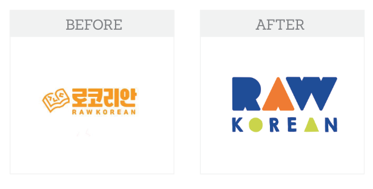
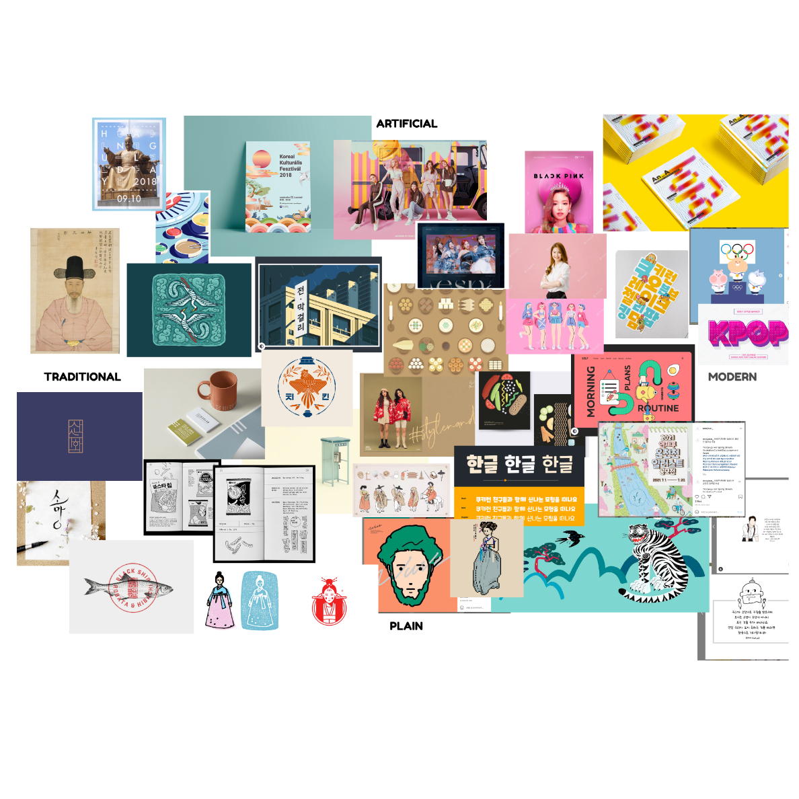
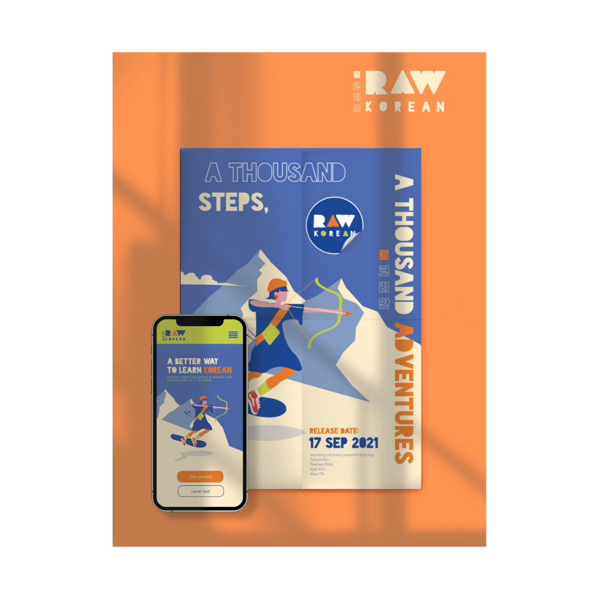
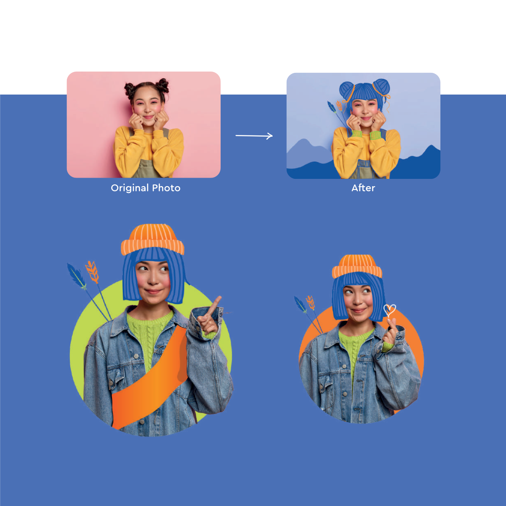
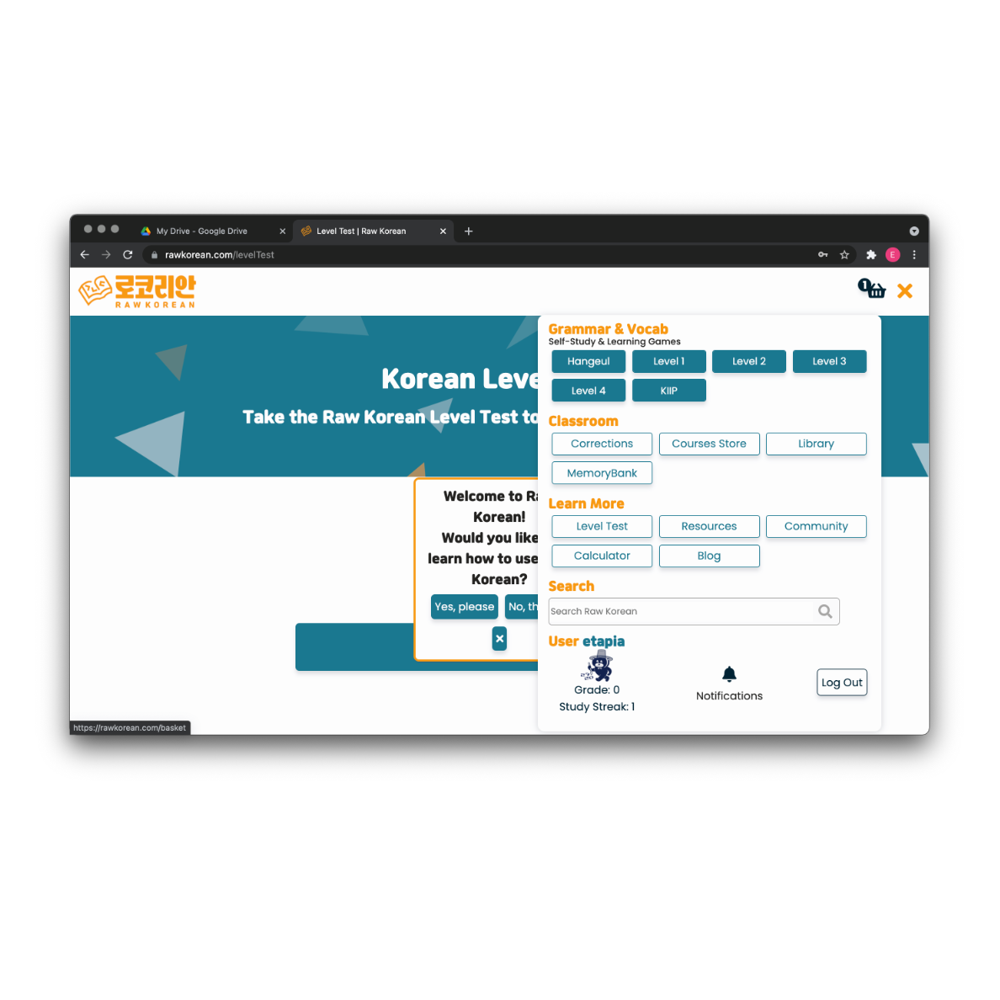
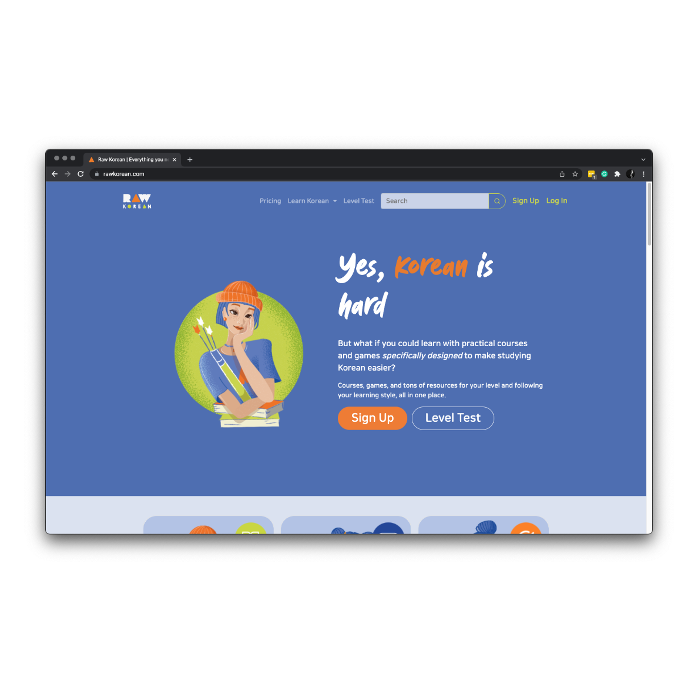

## Female empowerment

One of the main conversations Raw Korean founders and I had was regarding the harsh name of the company. 

Although initially conceived to show the power of women, they wanted a toned down brand.

## Rebrand for fun
However their initial take on the brand felt like it lost personality in the process of toning down. 

To deevelop a fun and engaging brand the colors, logo and communication style were reworked.
By working with the insipirational figure of an archer various [brand proposals](https://www.behance.net/gallery/131581583/Brandbook-web-design-RawKorean) were created by [@galya_kimka302c](https://www.behance.net/Galya_Kimka302c). 

## UI/UX 
[@Panhee](https://panheeisme.com/) created wireframes that were used later to prototype HTML + CSS pages that reworked Raw Korean's website to incorporate design principles and better navigation elements, including a side scroll *a la Netflix*. 

