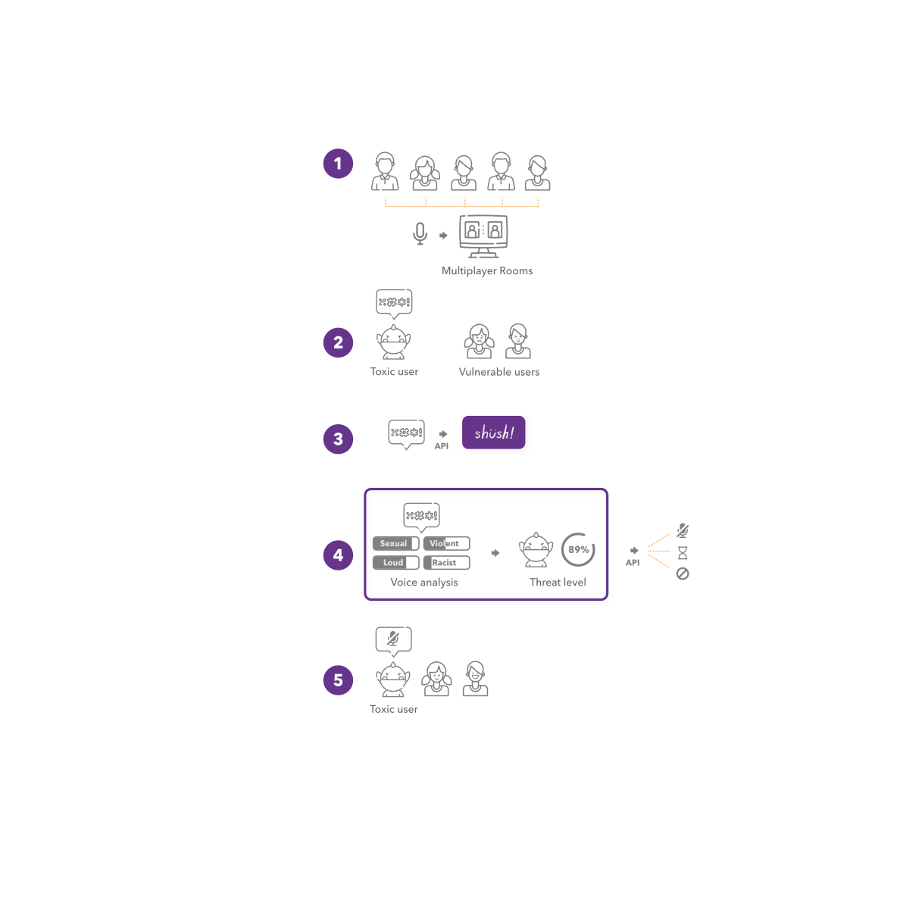

## Summary 
Esteban was in charge of product concept, product management and product launch.

## 1. Research and Strategy

Analyzing the market conditions of Korea, showed large investments into entertainment, big data and AI. Within entertainment the gaming industry had an ongoing problem that kept coming up in many reports: Toxicity. 

An opportunity to launch a service that would support ongoing efforts by the gaming industry to curb toxicity with the power of voice-based ML and NLP arose.

To develop our solution we spoke with companies (from small to market leaders) in the gaming industry through referrals, events and cold contacts. 

### 2. Product Design

Along with a team comprised of NLU and ML engineers and using existing open source technology we created: Shush CM. 

Shush curbs abuse in communications by detecting language that can cause harm. It aims to increase diversity online and protect minorities, women and kids. 

Esteban project managed the dev team while the solution went through various stages: 

|Idea|Development|Staging|Launch|
|---|---|---|---|
|Concept| Demo, Test case (local), test case (cloud) | API services + front-end | alpha|

#### Integrations
Shush CM has a discord integration that sends information to the API. 

The meta data from the recording is displayed in a JAMStack front-end which I developed using reactJS.

Esteban also developed two integrations for Zendesk: 

* As an API call from the front-end using JSON
* As a packaged Zendesk app using Javascript

### 3. Launch 

As a startup with only months of existence:
* We obtained the preStartup Package from Hanyang University 
* We participated in the Global Acceleration Program that paired us with one of Beijing's leading accelerator: Innoway
* We participated in the K-Startup Program 2021 (<3% selection rate)
* We also participated in other programs: Next Unicorn, SNU's Herero, etc.

#### Other tasks
Esteban participated in various programs (including pitching and networking), prepared the presentations, designed the *brand*, other communications (website and blog), and promotion through online and offline events. 

