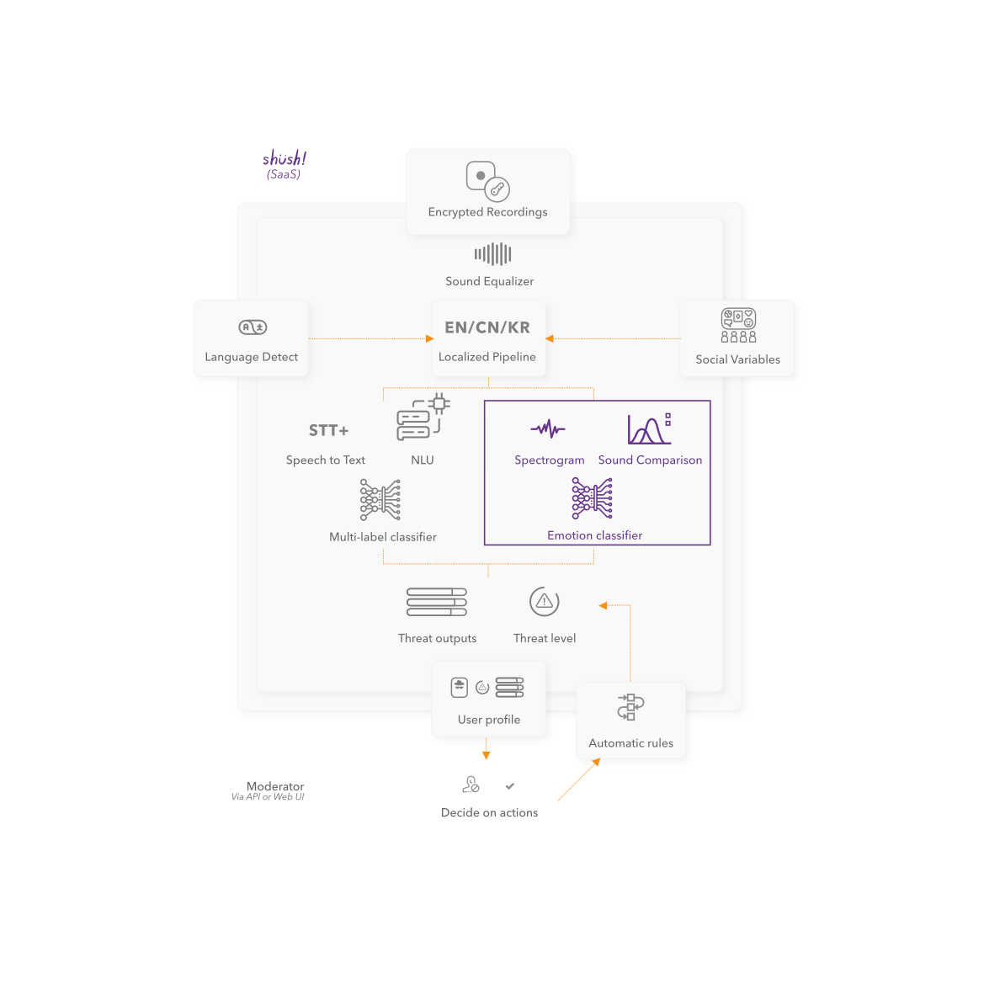

Shush aims to curb abuse in communications by detecting language that can cause harm. 
Increasing diversity online and protecting minorities, women and kids. 

## Product Management
In charge of product concept, product management and product launch.

While researching the gaming industry a problem kept coming up in many reports: Toxicity. 

Using existing open source technology applied to new cases and working with NLU experts a solution was created:
Shush CM. 

The solution went through various stages: concept, test case (local), test case (cloud), API and then a front-end.  

## Other tasks
To support the backend heavy team, I learned react to developed the *front end* of the solution. 
I also handled the *brand*, communications (website and blog),  user research and promotion through online and offline events. 

