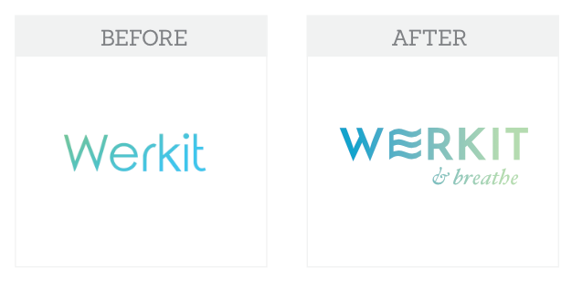
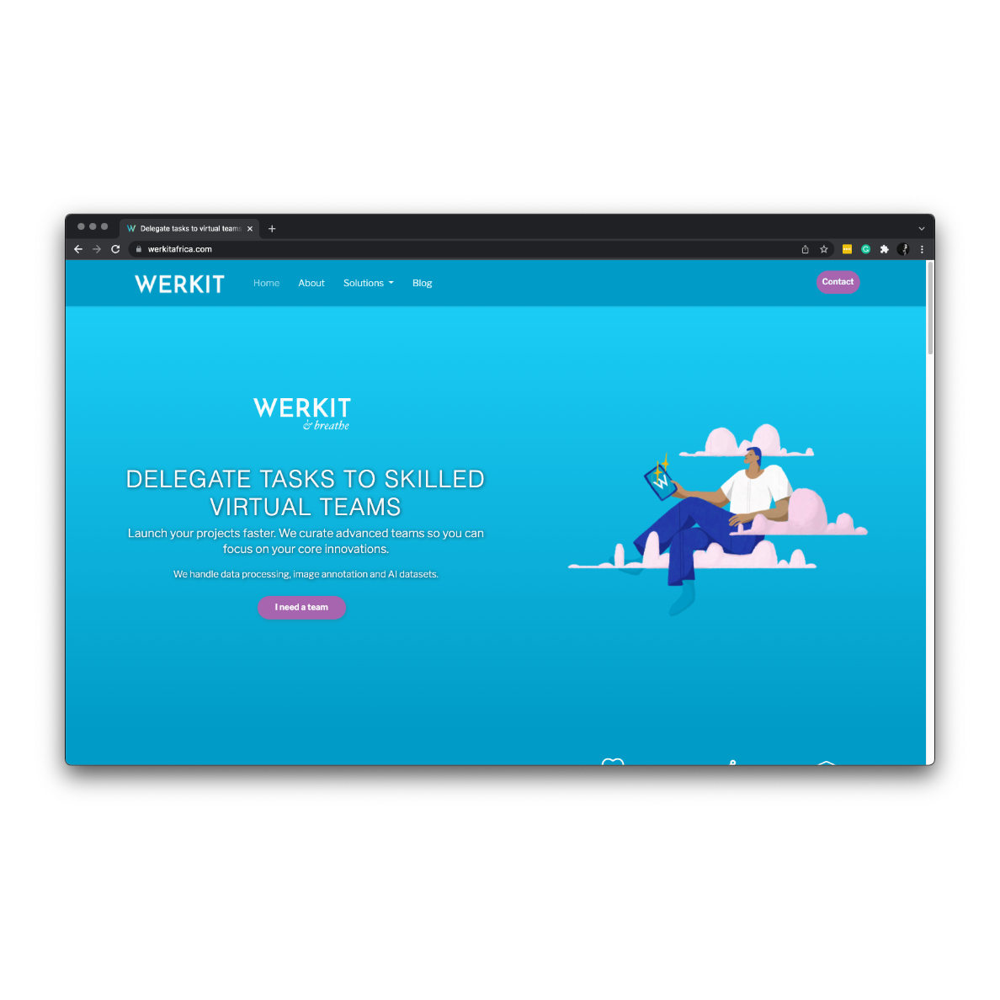
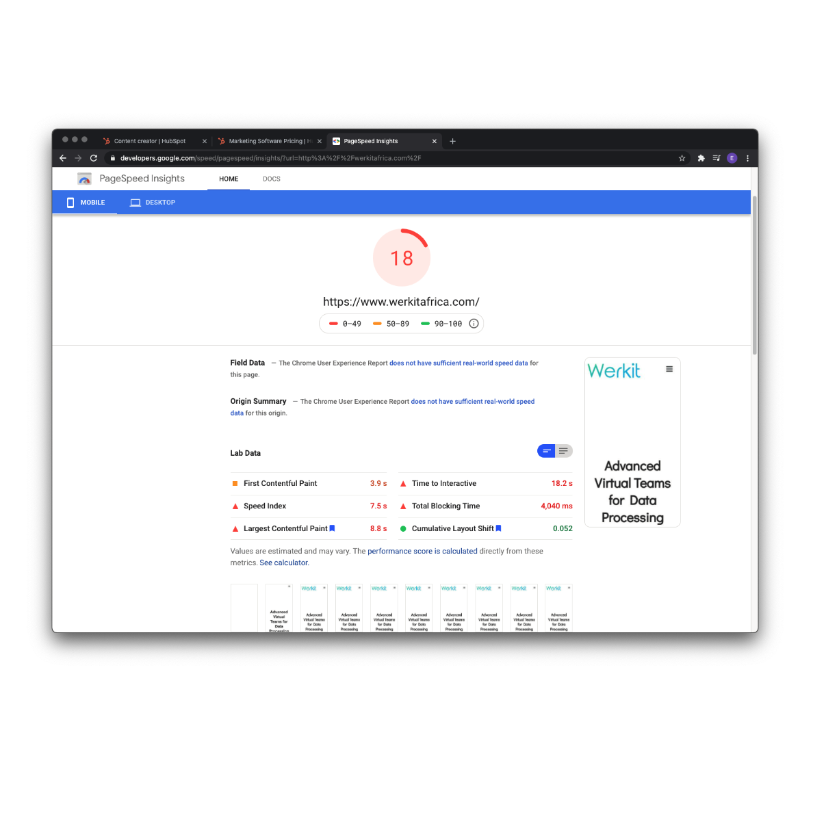
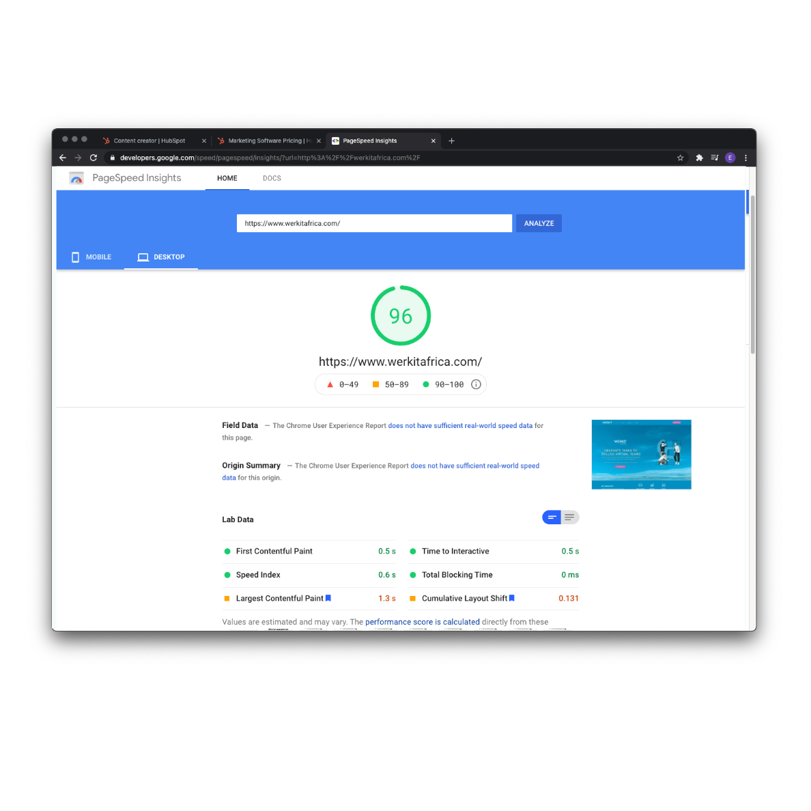
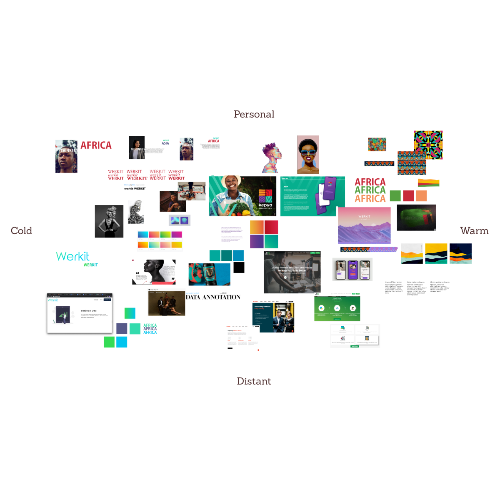
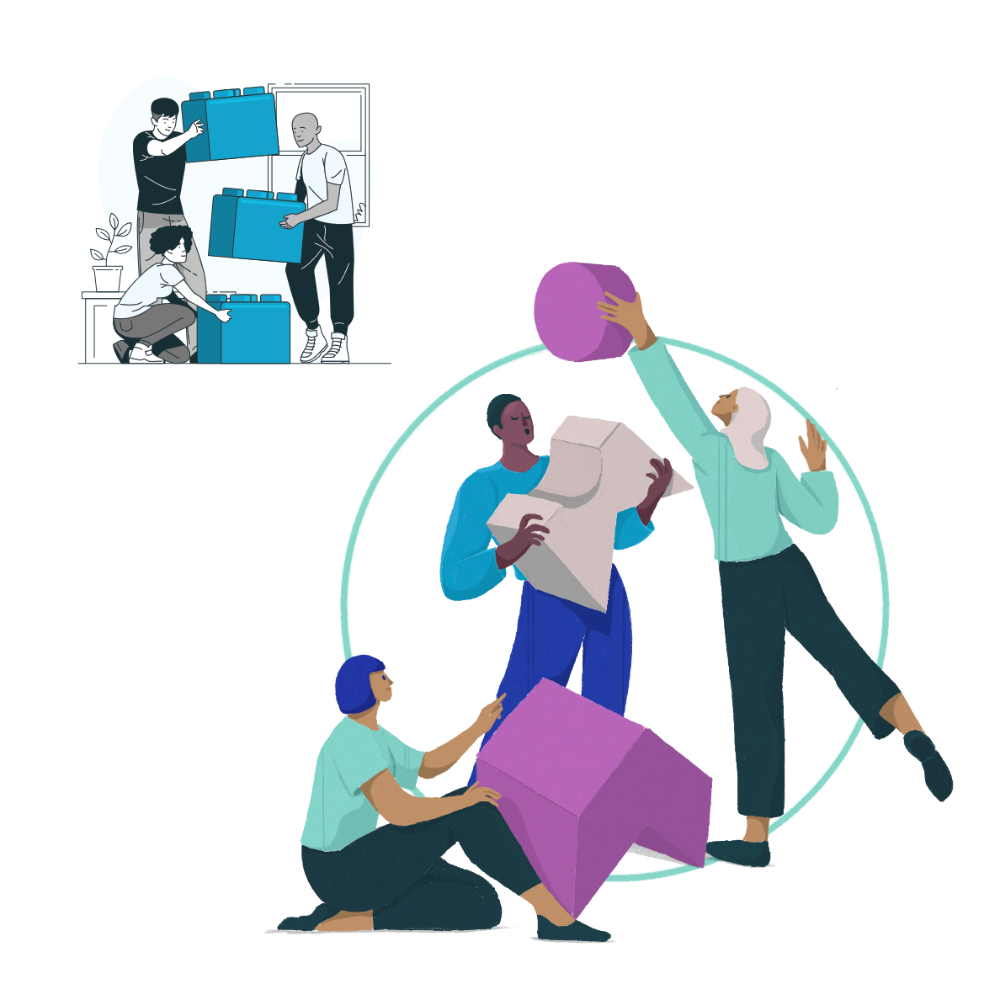
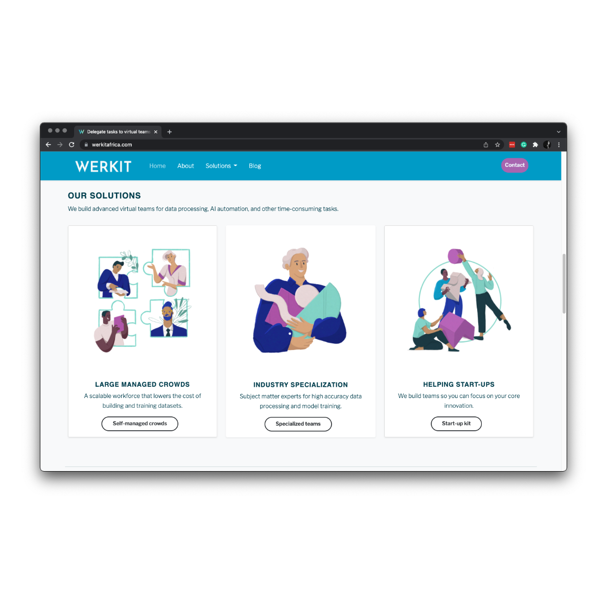
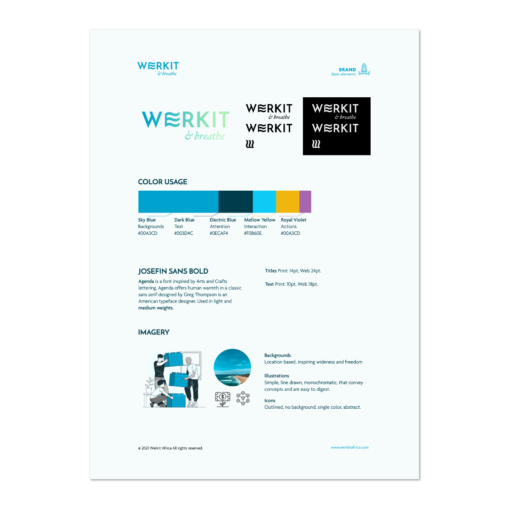

## Providing talent for AI

Werkit has a good business model and an interesting take on the outsourcing concept: by delegating tasks to highly educated personnel in third countries they can support the development of AI startups as well as improving the work environment of Africa.

## Brand
The company had grown very fast and the marketing material, although functional, lacked finesse. The overall sense was of stock content that had been hastily put together. 

Although the original colours were maintained the brand was fully reworked using core values based on simplicity. 
Paired with a humanistic illustration by [@magrat](https://www.behance.net/magrat)

## Web
The content was rewritten using a more personal touch to remove the coldness of the service and include key search terms. The website was redesigned prioritizing SEO metrics after researching competitors. 

